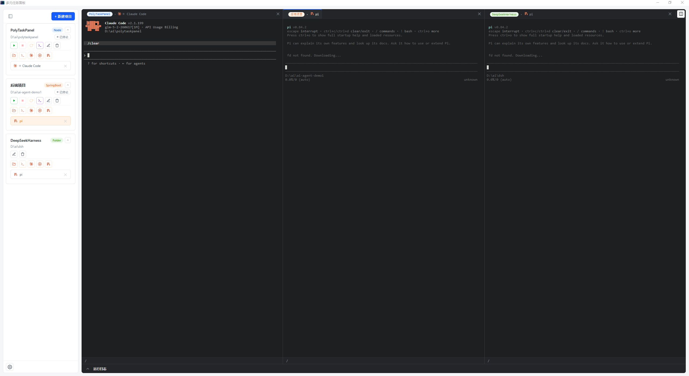

# PolyTaskPanel

> Windows 本地的多元任务面板：用 Web 界面管理 SpringBoot / Node 项目，一键启动、实时日志、停止杀进程树，并内置 Claude Code / Codex / pi 交互式终端。

版本：**2.1.1**

---

## 目录

- [功能特性](#功能特性)
- [技术栈](#技术栈)
- [环境要求](#环境要求)
- [快速开始](#快速开始)
- [开发模式](#开发模式)
- [打包桌面应用](#打包桌面应用)
- [配置项](#配置项)
- [项目结构](#项目结构)
- [API 一览](#api-一览)
- [测试](#测试)
- [工作原理](#工作原理)
- [许可](#许可)

---

## 功能特性

- **项目管理**：支持 SpringBoot、Node、Folder 三种类型；新增 / 编辑 / 删除 / 拖拽排序，数据持久化到 `projects.json`。
- **一键启动 / 停止 / 重启**：停止时递归 `taskkill /T` 杀掉整个进程树，不留孤儿进程占端口。
- **实时日志**：宿主项目日志走 ANSI→HTML 渲染，支持清空日志。
- **按类型启动**：
  - **SpringBoot**：`mvn spring-boot:run -pl <module>`，可勾选「先编译依赖模块」（`mvn compile -Dmaven.test.skip=true -pl <module> -am`）。
  - **Node**：自定义启动命令（如 `pnpm run dev`）。
  - **Folder**：仅作为目录容器，不启动脚本，用于挂载终端会话。
- **内置终端会话**：基于真 PTY（`node-pty`）+ `xterm.js`，在项目目录里开交互式终端：
  - **Claude Code** / **Codex** / **pi**：完整 TUI 可用（光标、清屏、Alt 屏、颜色）。
  - **cmd**：普通 Windows cmd shell。
- **文件目录浏览**：左侧活动栏点击打开，固定停靠面板懒加载项目目录树；支持在资源管理器中打开目录。
- **Git 管理**：左侧固定停靠面板（与文件面板互斥）：查看分支与变更、勾选暂存 / 提交、Pull / Push、切换分支、浏览提交历史与 diff（增删行着色）。
- **多栏分屏**：主区 1~4 栏并列，可同时查看多个会话 / 日志。
- **左侧固定抽屉**：最左活动栏（项目 / 文件 / Git 三开关 + 底部设置），点按展开对应面板、再点收起；抽屉宽度可拖拽调整，固定挤压终端区不浮动遮挡；项目面板顶部支持一键全部折叠 / 全部展开项目卡片。
- **文件夹选择**：原生文件夹选择对话框，免手填路径。
- **可选桌面壳**：Tauri 打包成原生 Windows 应用，自带 WebView2 窗口与 NSIS 安装包。



---

## 技术栈

| 层 | 技术 |
|---|---|
| 后端 | Node.js、Express、ws（WebSocket） |
| 终端 | node-pty（真 PTY）、@xterm/xterm + @xterm/addon-fit |
| 前端 | 单文件 HTML（无框架），xterm.js |
| 桌面壳（可选） | Tauri 2、Rust、WebView2 |
| 测试 | Node 内置 `node:test` |

---

## 环境要求

- **操作系统**：Windows（依赖 `taskkill`、`COMSPEC` 等）。
- **Node.js**：建议 LTS 版本。
  - `node-pty` 为 native C++ addon，安装时需编译环境（Windows 上需 Visual Studio Build Tools / Python），其 ABI 必须与运行它的 Node 一致。
- **（仅打包需要）Rust 工具链**：`cargo` 需在 PATH 中（`dev.bat` / `build.bat` 会把 `%USERPROFILE%\.cargo\bin` 加入 PATH）。
- **（按需）外部 CLI**：`claude`、`codex`、`pi`、`mvn`、`pnpm` 等需自行安装并加入 PATH。

---

## 快速开始

```bash
# 1. 安装依赖（含 native addon node-pty，首次需编译）
npm install

# 2. 直连运行
npm start
# 或双击 run.bat

# 3. 浏览器访问
# http://localhost:7777
```

`run.bat` 会先清理占用 7777 端口的残留进程，再启动并自动打开浏览器。

### 添加一个项目

1. 点击项目面板右上角「新建项目」。
2. 填写名称、选择类型（SpringBoot / Node / Folder）。
3. 用「选择文件夹」指定项目路径。
4. SpringBoot 填模块名（`moduleName`），可选「编译依赖模块」；Node 填启动命令。
5. 保存后即可在卡片上启动 / 停止 / 查看日志，或在项目目录里开 Claude / Codex / pi / cmd 终端。

---

## 开发模式

开发模式用 Tauri 启动 Rust 壳 + Node 服务（动态端口）+ WebView2 窗口：

```bash
npm run tauri:dev
# 或双击 dev.bat
```

也可以仅调试后端 / 前端：

```bash
npm start          # 后端 + 静态前端，浏览器访问
```

---

## 打包桌面应用

打包会产出 Windows NSIS 安装包（`src-tauri/target/release/bundle/`）：

```bash
npm run tauri:build
# 或双击 build.bat
```

`build.bat` 会先执行 `src-tauri/fetch-node.js`，下载一个固定版本的 Node win-x64 二进制到 `src-tauri/bundled-node/`，使 release 运行时所用 Node 与 `node-pty` 的 native `.node` ABI 始终匹配。打包资源（`server.js`、`public/`、`node_modules/`、`bundled-node/` 等）在 `src-tauri/tauri.conf.json` 的 `bundle.resources` 中声明。

---

## 配置项

通过环境变量配置（优先级：命令行参数 > 环境变量 > 默认值）：

| 变量 | 默认值 | 说明 |
|---|---|---|
| `PORT` | `7777` | 服务监听端口。Tauri 套壳时由 Rust 壳选空闲端口传入。也可用 `--port=N` 命令行参数覆盖。 |
| `CLAUDE_BIN` | `claude` | Claude 终端调用的可执行文件。 |
| `CLAUDE_ARGS` | （空） | Claude 终端的额外参数，空格分隔。 |
| `CODEX_BIN` | `codex` | Codex 终端调用的可执行文件。 |
| `CODEX_ARGS` | `-a never` | Codex 终端的额外参数；设了则整体覆盖默认值。 |
| `PI_BIN` | `pi` | pi 终端调用的可执行文件。 |
| `PI_ARGS` | （空） | pi 终端的额外参数，空格分隔。 |
| `PROJECTS_FILE` | `./projects.json` | 项目列表持久化文件路径。测试时常用临时目录避免污染真实数据。 |
| `PUBLIC_DIR` | `./public` | 静态前端目录。 |

> `node-pty` 加载失败时不致命：Claude / Codex / pi 终端功能不可用，但启动器其余功能照常。创建会话时会返回明确错误。

---

## 项目结构

```
PolyTaskPanel/
├── server.js              # 后端：Express + WebSocket + PTY 管理
├── public/
│   ├── index.html         # 单文件前端（UI + xterm.js）
│   └── logo.png
├── projects.json          # 项目列表持久化（运行时生成）
├── run.bat                # 直连运行（端口 7777）
├── dev.bat                # Tauri 开发模式
├── build.bat              # Tauri 打包
├── package.json
├── src-tauri/             # Tauri 桌面壳（Rust）
│   ├── src/               # Rust 侧：选端口、拉起 server.js、开窗口
│   ├── tauri.conf.json    # 打包配置（NSIS、resources）
│   ├── fetch-node.js      # 下载固定版本 Node 二进制
│   ├── bundled-node/      # 打包用 Node（构建时下载）
│   └── icons/
├── test/                  # node:test 测试
├── docs/                  # 文档
└── ABOUT.md
```

---

## API 一览

### 项目管理

| 方法 | 路径 | 说明 |
|---|---|---|
| `GET` | `/api/projects` | 列出全部项目 |
| `POST` | `/api/projects` | 新建项目 |
| `PUT` | `/api/projects/:id` | 更新项目 |
| `DELETE` | `/api/projects/:id` | 删除项目 |
| `POST` | `/api/projects/reorder` | 调整排序 |
| `POST` | `/api/projects/:id/start` | 启动项目 |
| `POST` | `/api/projects/:id/stop` | 停止项目（杀进程树） |
| `POST` | `/api/projects/:id/restart` | 重启项目 |
| `GET` | `/api/projects/:id/command` | 获取启动命令 |
| `GET` | `/api/projects/:id/logs` | 获取日志 |
| `POST` | `/api/projects/:id/clear-logs` | 清空日志 |
| `POST` | `/api/projects/:id/explorer` | 在资源管理器中打开项目（或子）目录 |
| `GET` | `/api/projects/:id/files` | 列出项目目录的一层条目（供文件浏览抽屉懒加载树） |
| `POST` | `/api/pick-folder` | 原生文件夹选择对话框 |

### Git 管理

`:id` 下统一前缀 `/git/`。非 git 仓库统一返回 `{ ok:false, notRepo:true }`。

| 方法 | 路径 | 说明 |
|---|---|---|
| `GET` | `/api/projects/:id/git/status` | 分支名 + 变更文件列表（porcelain XY 状态） |
| `POST` | `/api/projects/:id/git/stage` | 暂存 / 取消暂存（body `files`、`unstage`） |
| `POST` | `/api/projects/:id/git/commit` | 提交（body `message`） |
| `POST` | `/api/projects/:id/git/push` | 推送（依赖命令行已配好的远端凭证） |
| `POST` | `/api/projects/:id/git/pull` | 拉取（同上） |
| `GET` | `/api/projects/:id/git/branches` | 本地分支列表 + 当前分支 |
| `POST` | `/api/projects/:id/git/checkout` | 切换分支（body `branch`） |
| `GET` | `/api/projects/:id/git/log` | 提交历史（`?limit=`，默认 30 上限 200） |
| `GET` | `/api/projects/:id/git/diff` | diff（`?file=` 工作区 / `?cached=1` 已暂存 / `?commit=` 某次提交） |

### 终端会话

`:type` 路径段为 `claude-sessions` / `codex-sessions` / `cmd-sessions` / `pi-sessions` 之一。

| 方法 | 路径 | 说明 |
|---|---|---|
| `GET` | `/api/projects/:id/:type` | 列出该项目下的活跃终端会话 |
| `POST` | `/api/projects/:id/:type` | 创建终端会话（cwd = 项目路径） |
| `DELETE` | `/api/projects/:id/:type/:sessionId` | 关闭终端会话（杀进程树） |
| `POST` | `/api/projects/:id/:type/:sessionId/resize` | 调整 PTY 尺寸（cols/rows） |

终端输入输出通过 WebSocket 双向流式传输，消息类型按终端区分（如 `claude-output` / `claude-input` / `claude-session`，Codex / cmd / pi 同理）。

### 其他

| 方法 | 路径 | 说明 |
|---|---|---|
| `GET` | `/about.md` | 获取 ABOUT 信息 |

---

## 测试

使用 Node 内置测试运行器：

```bash
npm test
```

覆盖 Claude / Codex / pi 会话契约、资源管理器与文件目录路由、面板共存与持久化、重连、左侧抽屉面板开关与调宽等场景。

---

## 工作原理

### 为什么用 node-pty（真 PTY）

`claude` 这类 CLI 是交互式 TTY 程序，会检测 `isatty`：用普通管道喂 stdin 它不认，TUI 不完整。因此必须起真 PTY，让程序认为自己在与真终端对话，光标 / 清屏 / Alt 屏 / 颜色才能正常工作。`xterm.js` 在前端做终端模拟，后端把 PTY 输出原样转发。

> release 构建用打包进 resources 的固定 Node 运行 `server.js`，因此 `node-pty` 的 native `.node` ABI 必然与运行时 Node 匹配（见「打包桌面应用」）。

### 为什么停止要杀进程树

`mvn` 会 fork 出 java 子进程，普通 `taskkill` 只杀父进程会留下孤儿 java 进程继续占用端口。停止项目 / 关闭终端会话时统一用递归 `taskkill /T` 杀整棵进程树，确保端口与资源彻底释放。

---

## pi 粘贴优化扩展（.pi/extensions/）

在部分终端（Git Bash/mintty、cmd/PowerShell conhost 等）里用 pi 时，粘贴多行提示词会在第一个换行处直接触发发送。原因：这些终端不启用 bracketed paste，粘贴的每个 `\r` 被 stdin 当作一次 Enter（submit）。

本仓库的 `.pi/extensions/paste-safe-editor.ts` 是一个 pi 项目级扩展，用时间窗口启发式区分「粘贴中的换行」与「手动 Enter」：

- 紧跟快速输入（<10ms）到达的换行 → 插入换行符，不提交；
- 孤立的 Enter → 挂起 30ms，期间无新输入才真正提交。

- 生效方式：在 pi 里运行 `/reload`（或重启 pi）；无需改动 pi 源码。
- 判定逻辑（`.pi/extensions/lib/paste-guard.mts`）有独立单元测试：`node --test test/paste-guard.test.mts`。

---

## 许可

MIT License（详见 LICENSE 文件，如未随附则按 MIT 条款使用）。
